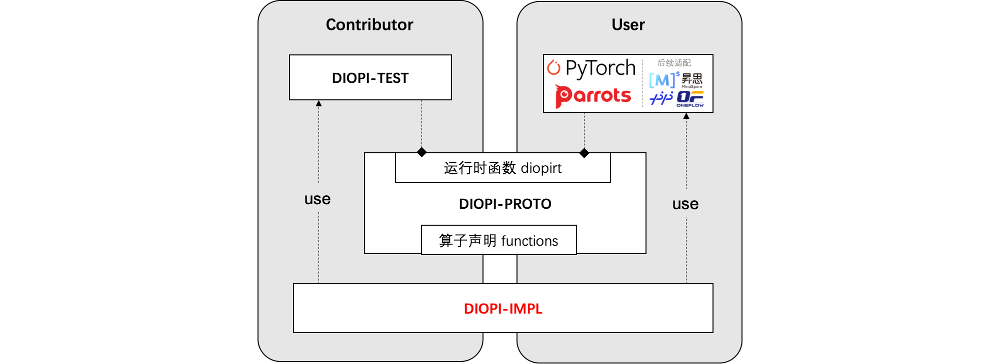

<div align=center>

</div>

# 介绍

DIOPI-设备无关算子接口（Device-Independent Operator Interface, DIOPI）在框架和芯片计算库之间定义了统一的**标准接口**。
旨在训练框架和人工智能芯片之间定义了一套计算契约，良好的函数抽象使得上（框架）下（芯片）两层在适配工程实施时能有效地解耦。
基于这套契约训练框架和人工智能芯片可以独立开发，并将下层芯片适配的工作复用到不同的训练框架适配中去，可降低芯片+框架的适配成本，保障算子实现正确性。

其主要的核心功能如下：
1. 提供120+个标准算子接口。涵盖了分类、检测、分割及姿态估计等多个领域深度学习模型所需训练算子。
2. 训练框架和硬件芯片的“桥梁”，提供统一的标准算子接口。以此降低训练框架和硬件芯片之间的适配成本，创造更好的国产训练生态。
3. 提供标准测试套件，为硬件芯片实现的算子库提供调试验证功能。

<!--1. DIOPI-PROTO 中定义了120多个标准算子接口，此处主要以功能角度计数，如 add 算子及其 scalar/inplace/backward 版本统计为 1 个算子接口。DIOPI 算子库涵盖了分类、检测、分割及姿态估计等多个领域深度学习模型所需训练算子。
2. DIOPI-IMPL 实现的标准算子库将使用统一的标准算子接口连接训练框架和硬件芯片，以此降低训练框架和硬件芯片之间的适配成本，创造更好的国产训练生态。
3. DIOPI-TEST 作为独立的测试框架为硬件芯片实现的算子库提供调试验证功能。-->


## 结构说明

<!---->



DIOPI主要包含以下几个组件：

- [DIOPI-PROTO](https://github.com/DeepLink-org/DIOPI/tree/main/DIOPI-PROTO)：声明了一套运行时函数接口(diopirt)和标准算子接口(function)。
- [DIOPI-IMPL](https://github.com/DeepLink-org/DIOPI/tree/main/DIOPI-IMPL)：对接硬件芯片。硬件厂商可在其中使用硬件软件栈提供的计算接口，实现算子功能。其使用 ```DIOPI-PROTO/include/diopi/diopirt.h``` 提供的接口实现 ```DIOPI-PROTO/include/diopi/functions.h``` 声明的标准算子, 并编译为 ```libdiopi_impl.so``` 动态库。在测试阶段，DIOPI-IMPL 还需实现并注册 ```DIOPI-TEST/include/diopi_register.h``` 声明的硬件芯片管理相关的函数。
- [DIOPI-TEST](https://github.com/DeepLink-org/DIOPI/tree/main/DIOPI-TEST)：用于保证算子功能正确性。实现 ```DIOPI-PROTO/include/diopi/diopirt.h``` 声明基础运行时函数，并调用 ```libdiopi_impl.so``` 进行测试验证。
<!-- * DIPU-Adapter 实现 DIOPI-PROTO/include/diopi/diopirt.h 声明基础运行时函数, 将 DIOPI 算子适配训练框架，保证训练框架调用 libdiopi_impl.so 进行模型训练。 -->

<!--
- [DIOPI-PROTO](https://github.com/OpenComputeLab/DIOPI/DIOPI-PROTO)：定义了若干运行时函数接口(diopirt)和算子声明接口(function)；
- [DIOPI-IMPL](https://github.com/OpenComputeLab/DIOPI/DIOPI-IMPL)：对接硬件芯片。硬件厂商可在其中使用硬件软件栈提供的计算接口，实现算子功能；
- [DIOPI-TEST](https://github.com/OpenComputeLab/DIOPI/DIOPI-TEST)：用于保证算子功能正确性(算子测试 + 模型验证)，通过LiteRT实现了运行时函数；
- [DIPU-Adapter](https://github.com/OpenComputeLab/DIPU-Adapter)：对接训练框架。其中实现了用于接入pytorch2.0的运行时函数；


一段结构流程说明 ***[补充说明，格式不定，说明各板块之间的关系即可]***。
-->


# Quick Start

## 硬件芯片适配

如需在硬件芯片中进行计算接口算子实现，可进行以下步骤（具体参考 [DIOPI](https://github.com/DeepLink-org/DIOPI#readme)）。


1. 需下载 [DIOPI仓库](https://github.com/DeepLink-org/DIOPI)，可使用命令：
    ```
    git clone https://github.com/DeepLink-org/DIOPI.git
    ```
2. 在 DIOPI-IMPL 中新建目录实现 ```DIOPI-PROTO/include/diopi/functions.h``` 声明的标准算子的函数。

    在设备相关目录下提供相应的编译文件，通过以下参考命令进行编译：
    ```
    cd DIOPI-IMPL && sh scripts/diopi_impl.sh torch
    ```

## 校验适配算子 <a id="test_tutor"></a>

芯片厂商完成相关算子适配后，可以下载 [DIOPI仓库](https://github.com/DeepLink-org/DIOPI)，并使用如下步骤进行算子正确性验证：

  1. 下载 DIOPI 测验仓库：
      ```
      git clone https://github.com/DeepLink-org/DIOPI.git
      ```
  2. 进入DIOPI-IMPL编译算子实现, 通过以下参考命令进行编译：
      ```
      export DIOPI_BUILD_TESTRT=ON && cd DIOPI-IMPL && sh scripts/diopi_impl.sh torch
      ```
  2. 进入python目录，生成基准数据(需准备nv机器和pytorch1.10环境)

      ```
      cd DIOPI-TEST && python && python main.py --mode gen_data
      ```
      **或** 使用提供的基准测试数据，下载所有数据压缩包，一个MD5SUMS文件。以Mac/Linux系统为例：
      ```
      // 使用md5sum 验证是否准确下载数据
      md5sum -c MD5SUMS

      // 拼接测试数据
      cat diopi_benchmark_data_v1.0.0.tar.gz* >> data.tar

      //解压data。data解压后的位置在：DIOPI-TEST/python/data
      tar -xf data.tar -C your_path_to_DIOPI-TEST/python/
      ```
  3. 将数据拷贝到芯片机器上，执行以下命令验证算子：
      ```
      python main.py --mode run_test
      ```

  4. 验证结果分析

      测例通过的输出形式如下：

      ```
      2022-09-29 16:40:40,550 - DIOPI-Test - INFO - Run diopi_functions.relu succeed
      ```
      
      失败的测例会额外存储测例输入参数的张量信息在 ```error_report.csv``` 中以供调试所需。

      ```
      DIOPI-Test Error Report
      ---------------------------------
      1 Tests failed:
      1--Run diopi_functions.batch_norm_backward failed.   TestTag: [float32, backward]  TensorInfo : [(input, float32, (32, 16, 112, 112)), (running_mean, float32, (16,)), (running_var, float32, (16,)), (weight, float32, (16,)), (bias, float32, (16,))]
      ---------------------------------
      Test skipped or op not implemented:
      ```

## Learn More
组件介绍
* [DIOPI-PROTO Readme](https://github.com/DeepLink-org/DIOPI/tree/main/DIOPI-PROTO#readme)
* [DIOPI-IMPL Readme](https://github.com/DeepLink-org/DIOPI/tree/main/DIOPI-IMPL#readme)
* [DIOPI-TEST Readme](https://github.com/DeepLink-org/DIOPI/tree/main/DIOPI-TEST#readme)
<!--* [DIPU-Adapter Readme](DIPU-Adapter.md)-->

其他文档
<!--* [API文档]{} -->
* [常见问题](https://deeplink-org.github.io/OpenComputeLab.github.io/5%20FAQ.html)
* [Release Note](https://github.com/DeepLink-org/DIOPI/releases)
* [开发者指南](https://github.com/DeepLink-org/DIOPI/blob/main/Contributors.md)
