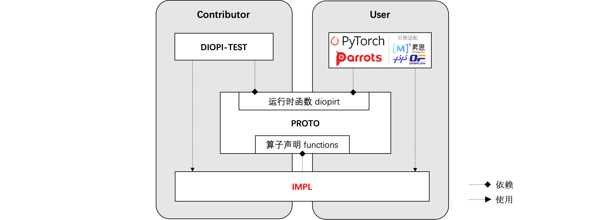

<div align=center>

</div>

# 介绍

DIOPI-设备无关算子接口（Device-Independent Operator Interface, DIOPI）在框架和芯片计算库之间定义了统一的**标准接口**。
旨在训练框架和人工智能芯片之间定义了一套计算契约，良好的函数抽象使得上（框架）下（芯片）两层在适配工程实施时能有效地解耦。
基于这套契约训练框架和人工智能芯片可以独立开发，并将下层芯片适配的工作复用到不同的训练框架适配中去，可降低芯片+框架的适配成本，保障算子实现正确性。

其主要的核心功能如下：
1. **提供200+个标准算子接口，包含LLaMa大模型算子接口**。涵盖了大模型、分类、检测、分割及姿态估计等多个领域深度学习模型所需训练算子。
2. **提供统一的标准算子接口，接入5+款国产芯片**。是训练框架和硬件芯片的“桥梁”，降低训练框架和硬件芯片之间的适配成本，创造更好的国产训练生态。
3. **提供标准测试套件，支持5000+个常见算子测例**，为硬件芯片实现的算子库提供调试验证功能。


## 结构说明



DIOPI主要包含以下几个组件：

- [DIOPI-PROTO](https://github.com/DeepLink-org/DIOPI/tree/main/DIOPI-PROTO)：声明了一套运行时函数接口(diopirt)和标准算子接口(function)。
- [DIOPI-IMPL](https://github.com/DeepLink-org/DIOPI/tree/main/DIOPI-IMPL)：对接硬件芯片。硬件厂商可在其中使用硬件软件栈提供的计算接口，实现算子功能。其使用 ```DIOPI-PROTO/include/diopi/diopirt.h``` 提供的接口实现 ```DIOPI-PROTO/include/diopi/functions.h``` 声明的标准算子, 并编译为 ```libdiopi_impl.so``` 动态库。在测试阶段，DIOPI-IMPL 还需实现并注册 ```DIOPI-TEST/include/diopi_register.h``` 声明的硬件芯片管理相关的函数。
- [DIOPI-TEST](https://github.com/DeepLink-org/DIOPI/tree/main/DIOPI-TEST)：用于保证算子功能正确性。实现 ```DIOPI-PROTO/include/diopi/diopirt.h``` 声明基础运行时函数，并调用 ```libdiopi_impl.so``` 进行测试验证。
- [DIOPI-ADAPTOR](https://github.com/DeepLink-org/DIOPI/tree/main/DIOPI-ADAPTOR)：用于提供辅助功能函数。目前提供的功能包括自动类型转换、内存分布转换等。


# Quick Start

## 仓库下载
如需在硬件芯片中进行计算接口算子实现，可进行以下步骤（具体参考 [DIOPI](https://github.com/DeepLink-org/DIOPI#readme)）。


1. 需下载 [DIOPI仓库](https://github.com/DeepLink-org/DIOPI)，可使用命令：
    ```
    git clone https://github.com/DeepLink-org/DIOPI.git
    ```

    如遇到权限问题，可以参考[FAQ-权限问题](https://deeplink.readthedocs.io/zh_CN/latest/doc/DIOPI/FAQ.html)


## 算子编译


1. 在设备相关目录下提供相应的编译文件，通过脚本进行编译：
    ```
    cd DIOPI-IMPL && sh scripts/build_impl.sh torch
    ```

    或者参考以下命令示例编译 DIOPI-IMPL：
    ```
    cd DIOPI-IMPL && mkdir build && cd build && cmake .. -DIMPL_OPT=cuda && make -j32
    ```


## 更新基准数据

1. 进入python目录，生成基准数据(需准备 nv 机器和 pytorch1.10 环境)
    ```
    cd python && python main.py --mode gen_data
    ```
    如需指定模型：
    ```
    python main.py --mode gen_data --model_name xxx
    ```
    其中支持的模型名可以通过如下命令获得：
    ```
    python main.py --get_model_list
    ```


## 校验算子
1. 将数据拷贝到芯片机器上，执行以下命令验证算子：
    ```
    python main.py --mode run_test
    ```
    如需指定模型：
    ```
    python main.py --mode run_test --model_name xxx
    ```
    如需过滤不支持的数据类型以及部分测试使用nhwc格式张量(如跳过float64以及int64测例)：
    ```
    python main.py --mode run_test --filter_dtype float64 int64 --nhwc
    ```
    可以查看[DIOPI-TEST Readme](https://github.com/DeepLink-org/DIOPI/tree/main/DIOPI-TEST#readme) 了解更详细的设置


2. 验证结果分析

    测例通过的输出形式如下：

    ```
    2022-09-29 16:40:40,550 - DIOPI-Test - INFO - Run diopi_functions.relu succeed
    ```
    
    失败的测例会额外存储测例输入参数的张量信息在 ```error_report.csv``` 中以供调试所需。

    ```
    DIOPI-Test Error Report
    ---------------------------------
    1 Tests failed:
    1--Run diopi_functions.batch_norm_backward failed.   TestTag: [float32, backward]  TensorInfo : [(input, float32, (32, 16, 112, 112)), (running_mean, float32, (16,)), (running_var, float32, (16,)), (weight, float32, (16,)), (bias, float32, (16,))]
    ---------------------------------
    Test skipped or op not implemented:
    ```


### 测例通过
测例通过的输出形式如下：
  ```
  2022-09-29 16:40:40,550 - DIOPI-Test - INFO - Run diopi_functions.relu succeed
  ```
### 测例失败

失败的测例会额外存储测例输入参数的张量信息在 error_report.csv 中以供调试所需。
  ```
  DIOPI-Test Error Report
  ---------------------------------
  1 Tests failed:
  1--Run diopi_functions.batch_norm_backward failed.   TestTag: [float32, backward]  TensorInfo : [(input, float32, (32, 16, 112, 112)), (running_mean, float32, (16,)), (running_var, float32, (16,)), (weight, float32, (16,)), (bias, float32, (16,))]
  ---------------------------------
  Test skipped or op not implemented:
  ```


## Learn More
组件介绍
* [DIOPI-PROTO Readme](https://github.com/DeepLink-org/DIOPI/tree/main/DIOPI-PROTO#readme)
* [DIOPI-IMPL Readme](https://github.com/DeepLink-org/DIOPI/tree/main/DIOPI-IMPL#readme)
* [DIOPI-TEST Readme](https://github.com/DeepLink-org/DIOPI/tree/main/DIOPI-TEST#readme)
* [DIOPI-ADAPTOR Readme](https://github.com/DeepLink-org/DIOPI/tree/main/DIOPI-ADAPTOR#readme)
<!--* [DIPU-Adapter Readme](DIPU-Adapter.md)-->

其他文档
<!--* [API文档]{} -->
* [常见问题](https://deeplink.readthedocs.io/zh_CN/latest/doc/DIOPI/FAQ.html)
* [Release Note](https://github.com/DeepLink-org/DIOPI/releases)
* [开发者指南](https://github.com/DeepLink-org/DIOPI/blob/main/Contributors.md)
